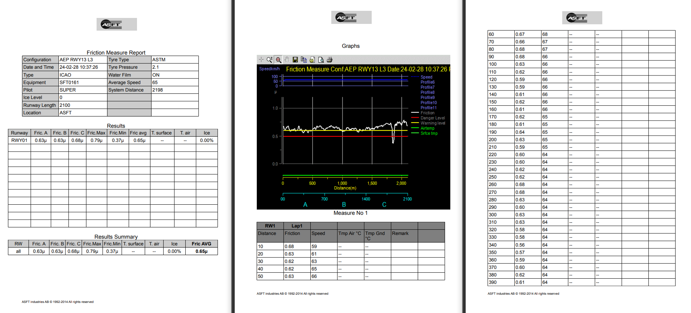
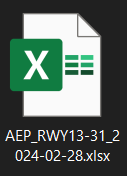
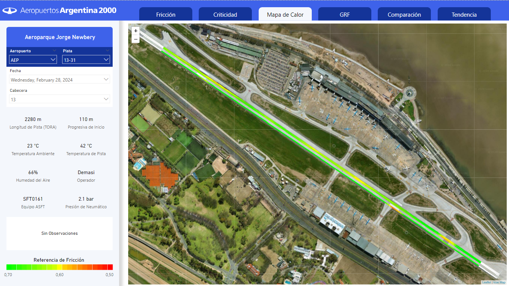
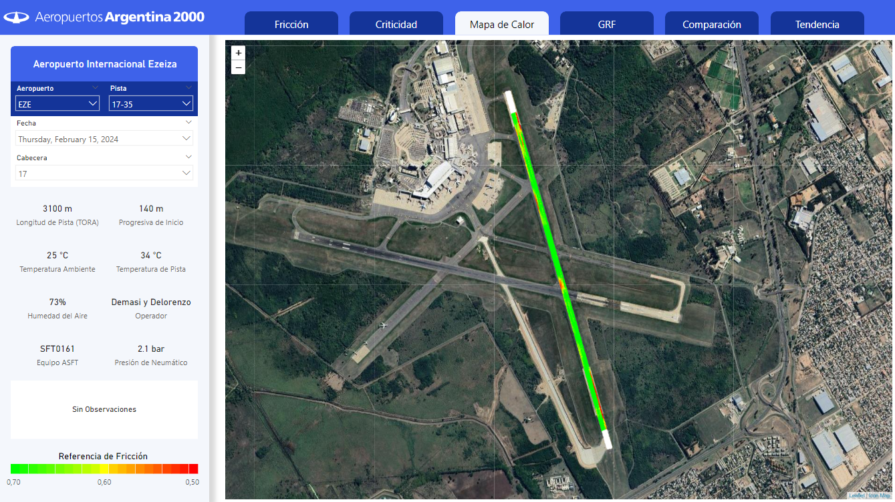

# ASFT Friction Measurement GUI Parser
## Overview
This GUI application simplifies the extraction, parsing, and creation of Excel files from Airport Surface Friction Tester (ASFT) friction measurement data reports.

## External Libraries Used
1. pypdf
2. pandas
3. openpyxl
4. tkinter

## Usage
### Obtaining ASFT Measurement files
Snippet of a friction measurement corresponding to Aeroparque Internacional Jorge Newbery.
Measurements are always given as tables within a pdf file.
For any specified runway, the number of unique measurements can reach up to 10, varying according to the width of the operating airplane's fuselage.
Example of a single measurement: 

### Running the ASFT Friction Measurement GUI Parser
Empty fields are filled with requiered information. 

### Created Excel File
Creates a excel workbook containing two worksheets with two worksheets. Información and Mediciones. 
 

### Measurements are loaded into the friction Power BI Dashboard

